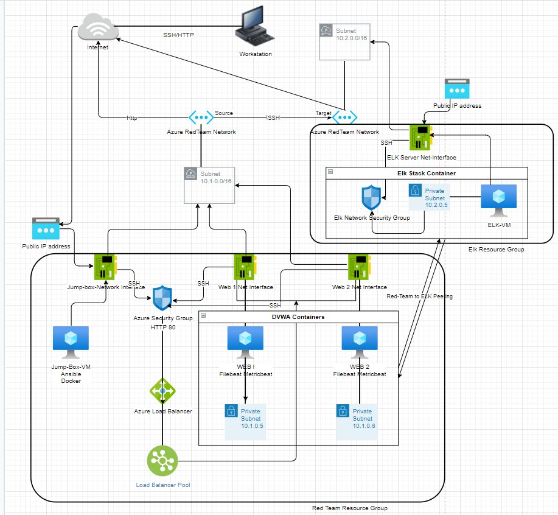
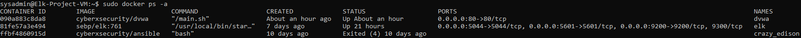

## Automated ELK Stack Deployment

The files in this repository were used to configure the network depicted below.



These files have been tested and used to generate a live ELK deployment on Azure. They can be used to either recreate the entire deployment pictured above. Alternatively, select portions of the Ansible playbook(.yml) file may be used to install only certain pieces of it, such as Filebeat.

- _[Installing Elk](Ansible/install-elk.yml)_
- _[Pentest DVWA](Ansible/pentest.yml)_
- _[Filebeat](Ansible/filebeat-playbook.yml)_
- _[Metricbeat](Ansible/metricbeat-playbook.yml)_

This document contains the following details:
- Description of the Topology
- Access Policies
- ELK Configuration
  - Beats in Use
  - Machines Being Monitored
- How to Use the Ansible Build


### Description of the Topology

The main purpose of this network is to expose a load-balanced and monitored instance of DVWA, the D*mn Vulnerable Web Application.

Load balancing ensures that the application will be highly responsive, efficient and available, in addition to restricting access and overload to the network.
- The load balancer can request a username and password before granting access to your website to protect against unauthorized access.
- The load balancer can detect and drop distributed denial-of-service (DDoS) traffic before it gets to your website.
- The advantage of a jump box is to give access to all users from a single point of entry which make it easier to secure and also monitor for unusual activities and remote connections.

Integrating an ELK server allows users to easily monitor the vulnerable VMs for changes to the configuration/logs and system traffic/files.
- Filebeat watches for changes of log files 
- Metricbeat collect metrics from the operating system and from services running on the server, it also takes metrics and statistics that it collects and ships them to the output that you specify, such as Logstash or Elasticsearch.

The configuration details of each machine may be found below.

| Name      | Function  | IP Address | Operating System |
|-----------|-----------|------------|------------------|
| Jump Box  | Gateway   | 10.1.0.4   | Linux            |
| Web-1     | DVWA      | 10.1.0.5   | Linux            |
| Web-2     | DVWA      | 10.1.0.6   | Linux            |
| Elk-1     | ELK Stack | 10.2.0.5   | Linux            |

### Access Policies

The machines on the internal network are not exposed to the public Internet. 

Only the Jump Box Provisioner machine can accept connections from the Internet. Access to this machine is only allowed from the following IP addresses:
- Personal Public whitelisted IP address

Machines within the network can only be accessed by SSH via port 22 through establishing a connection with the Jump Box provisioner machine.
- The Jump Box provisioner virtual machine was the only one allowed to access the ELK VM. The Jump Box machine’s IP is 10.1.0.4

A summary of the access policies in place can be found in the table below.

| Name        | Publicly Accessible | Allowed IP Addresses |
|-------------|---------------------|----------------------|
| Jump Box    | Yes                 | Home Whitelisted IP  |
| Web-1 DVWA  | No                  | 10.1.0.5             |
| Web-2 DVWA  | No                  | 10.1.0.6             |
| ElkStack-VM | No                  | 10.2.0.5             |

### Elk Configuration

Ansible was used to automate configuration of the ELK machine. No configuration was performed manually, which is advantageous because...

- Automated installation of build and deployment with efficiency and speed.
- Small learning curve without need of extensive coding knowledge and reusable. 
- All commands can be entered into multiple servers from a single playbook, facilitating things like software and OS updates.

The playbook implements the following tasks:

- Installation of Docker.io 
- Installation of Python-pip
- Installation of Docker
- Increase of system memory by using: sysctl -w vm.max_map_count=262144
- Launch docker Elk container
- Enable Docker services
- Launch DVWA Docker container


The following screenshot displays the result of running `docker ps` after successfully configuring the ELK instance.



### Target Machines & Beats
This ELK server is configured to monitor the following machines:

- Web-1: VM-DVWA 10.1.0.5
- Web-2: VM-DVWA 10.1.0.6

We have installed the following Beats on these machines:
- Filebeat 
- Metricbeat

These Beats allow us to collect the following information from each machine:
- Filebeat: monitors log files or locations specified locations, collects log events and send them to a specified output for indexing like Elasticsearch or Logstash

- Metricbeat collects metrics and statistics from the operating system and from services running on the server and ships them to a specified output like Logstash or Elasticsearch. 

### Using the Playbook
In order to use the playbook, you will need to have an Ansible control node already configured. Assuming you have such a control node provisioned: 

SSH into the control node and follow the steps below:
- Copy the playbook config file to /etc/ansible/files/.
- Update the Ansible hosts file to include:

```
[webservers]
10.1.0.5 ansible_python_interpreter=/usr/bin/python3
10.1.0.6 ansible_python_interpreter=/usr/bin/python3

[elkservers]
10.2.0.5 ansible_python_interpreter=/usr/bin/python3
```

- Update the Ansible configuration file `/etc/ansible/ansible.cfg` and set the remote_user parameter to the admin user of the web servers.

- Run the playbook, and navigate to http://[your_elk_server_public_ip]:5601/app/kibana to check that the installation worked as expected.

_Here are commands the user will need to run to download the playbook, update the files, etc._

1. ssh into the Jump Box `ssh azurered@<Jump Box Public IP>`
2. List available Docker containers `sudo docker container list -a`
3. Start the Docker container `sudo docker start <Docker Container>`
4. Attach to the Docker container with the command `sudo docker attach <Ansible Container Name>`
5. Make sure the configuration files are configured properly:
	* `/etc/ansible/ansible.cfg`
	* `/etc/ansible/hosts`
	* `/etc/ansible/files/filebeat-config.yml`
	* `/etc/ansible/files/metricbeat-config.yml`
	Do not forget to curl these two files prior to setup:
	* `curl https://gist.githubusercontent.com/slape/5cc350109583af6cbe577bbcc0710c93/raw/eca603b72586fbe148c11f9c87bf96a63cb25760/Filebeat > /etc/ansible/filebeat-config.yml`
	* `curl https://gist.githubusercontent.com/slape/58541585cc1886d2e26cd8be557ce04c/raw/0ce2c7e744c54513616966affb5e9d96f5e12f73/metricbeat > /etc/ansible/metricbeat-config.yml`
6. Run the playbooks with the following commands:
	* `ansible-playbook /etc/ansible/pentest.yml`
	* `ansible-playbook /etc/ansible/install-elk.yml`
	* `ansible-playbook /etc/ansible/roles/filebeat-playbook.yml`
	* `ansible-playbook /etc/ansible/roles/metricbeat-playbook.yml`


